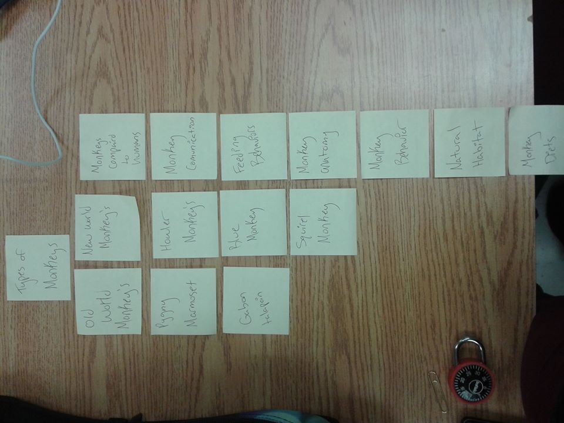
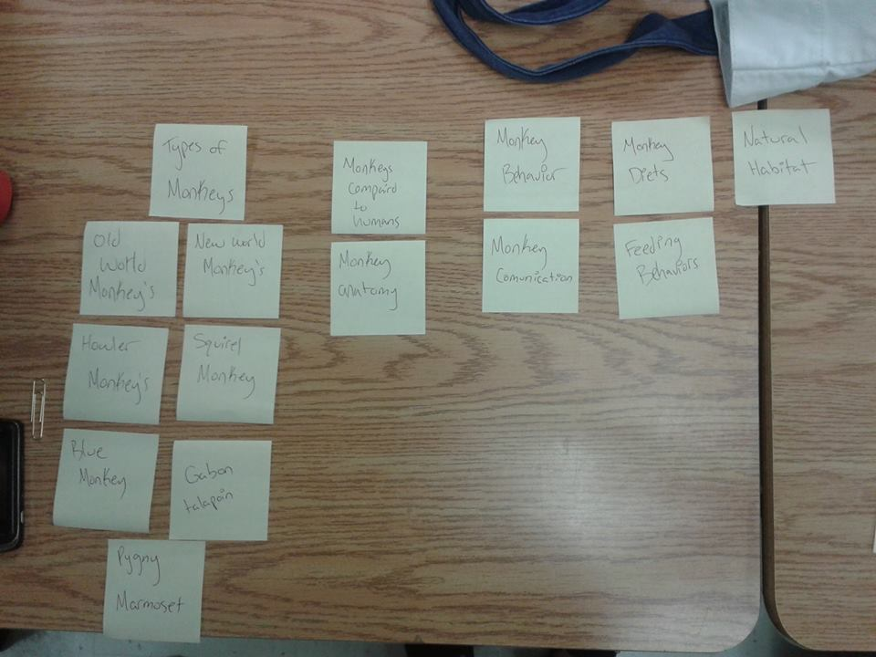

# Card sort report

The purpose of this card sort was to determine common navigation patterns and categories from the content of {your large data-oriented website}.

## Specifics

The card sort was conducted by Michaela Tuor on September 10th 2013 between the times of 3pm and 6pm with the following participants:

- Jenny Richardson
- Grace Morton

### Cards

15 cards were used covering a broad range of applicable content for the website. The following topics were used as cards:

1. Types Of Monkeys
2. New World Monkeys
3. Old World Monkeys
4. Howler Monkey
5. Monkey Diets
6. Natural Habitat
7. Pygny Marmoset
8. Monkey anatomy
9. Monkey compaird to humans
10. Monkey Behavior
11. Squirel monkey
12. Feeding behavior
13. monkey comunication
14. blue monkeys
15. Spider Monkeys

## Card sort results

*Card sort 1 by Grace Morton*

*Card sort 2 by Jenny Richardson*

## Observations

- Did the participants have any common comments?
	- Not really no...
- Did they have questions that stood out?
	- If a certain word was a monkey or something else (example: Pygny marmoset)
- Did they struggle with certain articles or topics?
	- They werent sure wat a new world monkey and a Old World Monkey was.
- Did they find common groupings? Or were the groupings completely different?
	- The groupings were about 75% the same between the two of them
- Were some of the groupings completely unexpected?
	- grace put everything that wasnt a type of monkey together, and I never thought of that.
- Were the results similar to your expectations?
	- For the most part yes, the results were quite similar!
- How did you feel while watching them perform the task?
	- While i wached them perform the task I was worried they wouldnt find any way to group it 